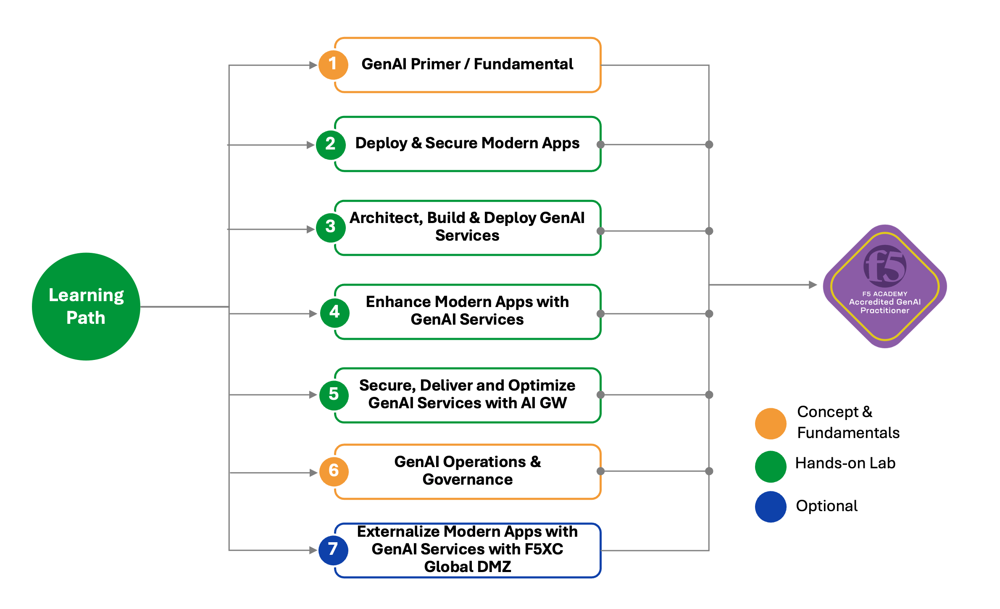

# Secure, Deliver and Optimize GenAI Apps with F5

**Note**: This is just a documentation repository. To access to GenAI Lab, please reach out to F5 representative.

GenAI skills and expertise are crucial for current and future organisations. It is paramount for organization to ensure any GenAI components deployed are secure and optimized to align with organisations overall AI strategy.

As a GenAI Practitioner, your mission is to secure, deliver and optimize a modern generative AI apps. These includes specializes in understanding, developing, securing and applying generative AI models and techniques to solve problems or create innovative solutions to drive business outcome. This role combines technical expertise, creativity, and domain knowledge to harness the potential of generative AI technologies like GPT, DALL-E, Stable diffusion and etc. You play a critical key business enabler role for the organization.

Here are those key learning paths

