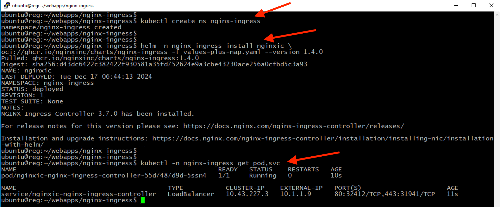
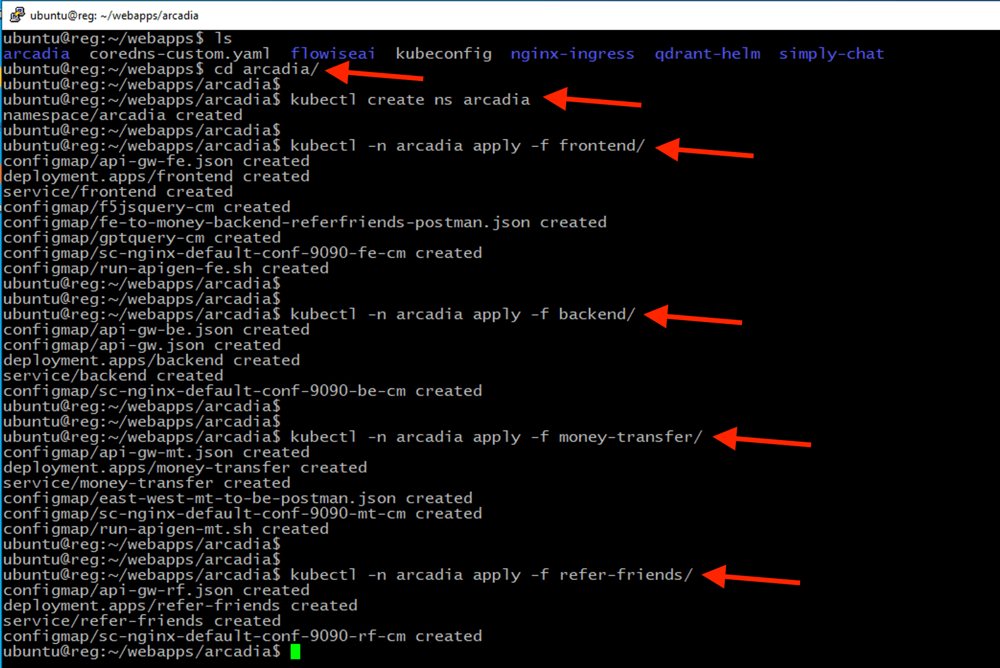
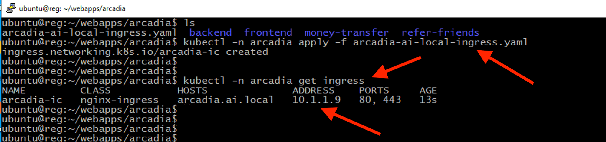
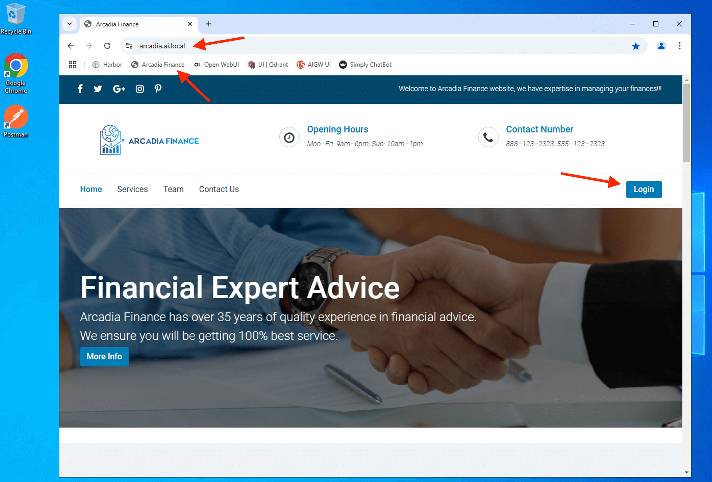
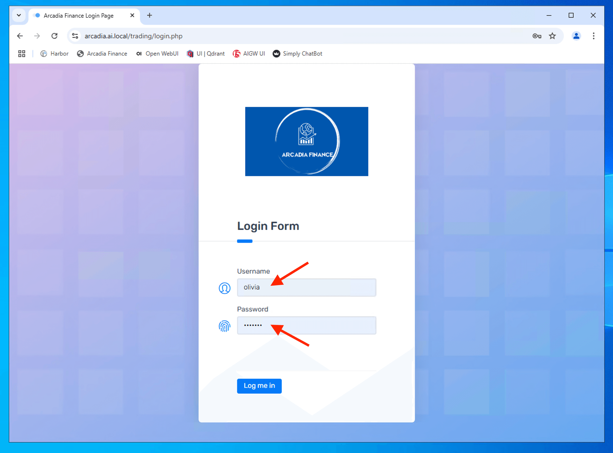

Class 2: Deploy and Secure a modern application
================================================

..  image:: ./_static/mission2.png

1 - Deploy Nginx Ingress Controller with App Protect to protect Web Apps Server
--------------------------------------------------------------------------------

After login to linux Jumphost, change directory to **webapps**. Jumphost server was installed with utilities called 'direnv' - https://direnv.net/. Its a tools that will load the environment file (kubeconfig) when you switch to that directory. Its an efficient tools to switch K8S context from one cluster to the other just by changing directory.

.. code-block:: bash

   cd webapps

.. code-block:: bash

     kubectl get node

.. code-block:: bash

     kubectl get po -A

..  image:: ./_static/class2-1.png

Execute the following command to install NGINX Ingress controlle with the provided helm chart.

.. code-block:: bash

   cd ~/webapps/nginx-ingress

.. code-block:: bash

   kubectl create ns nginx-ingress

.. code-block:: bash

   helm -n nginx-ingress install nginxic \
   oci://ghcr.io/nginxinc/charts/nginx-ingress -f values-plus-nap.yaml --version 1.4.0

.. code-block:: bash

   kubectl -n nginx-ingress get pod,svc

.. Note:: 
   Please note that the purpose of this lab is not to provide a comprehensive guide for installing the NGINX Ingress Controller for AppProtect. Instead, it focuses on setting up a basic infrastructure to secure, deliver, and optimize GenAI applications. For detailed configuration best practices, please refer to the official documentation.

   **values-plus-nap.yaml** is the modified values file for nginx-ingress helm chat. There were few variable being updated for this deplayment.

values-plus-nap.yaml ::

   appprotect:
    ## Enable the App Protect WAF module in the Ingress Controller.
    enable: true

   image:
    ## The image repository of the Ingress Controller.
    repository: reg.ai.local/ngx/nginx-plus-nap-ingress

    ## The tag of the Ingress Controller image. If not specified the appVersion from Chart.yaml is used as a tag.
    tag: "3.7.0"

    ## It is recommended to use your own TLS certificates and keys
    defaultTLS:
      ## The base64-encoded TLS certificate for the default HTTPS server.
      ## Note: It is recommended that you specify your own certificate. Alternatively, omitting the default server   secret completely will configure NGINX to reject TLS connections to the default server.
      cert: "xxxxxxx"
  
    ## The base64-encoded TLS key for the default HTTPS server.
      ## Note: It is recommended that you specify your own key. Alternatively, omitting the default server secret   completely will configure NGINX to reject TLS connections to the default server.
      key: "xxxxxxx"
  
    wildcardTLS:
      ## The base64-encoded TLS certificate for every Ingress/VirtualServer host that has TLS enabled but no   secret specified.
      ## If the parameter is not set, for such Ingress/VirtualServer hosts NGINX will break any attempt to   establish a TLS connection.
      cert: "xxxxxxx"
  
      ## The base64-encoded TLS key for every Ingress/VirtualServer host that has TLS enabled but no secret   specified.
      ## If the parameter is not set, for such Ingress/VirtualServer hosts NGINX will break any attempt to   establish a TLS connection.
      key: "xxxxxxx" 

2 - Deploy Arcadia Financial Modern Apps
----------------------------------------

Deploy Arcadia Financial application on Kubernetes

.. code-block:: bash

   cd ~/webapps/arcadia

.. code-block:: bash

   kubectl create ns arcadia

.. code-block:: bash

   kubectl -n arcadia apply -f frontend/

.. code-block:: bash

   kubectl -n arcadia apply -f backend/

.. code-block:: bash

   kubectl -n arcadia apply -f money-transfer/

.. code-block:: bash

   kubectl -n arcadia apply -f refer-friends/

Ensure all microservices are Ready and Running

.. code-block:: bash

   kubectl -n arcadia get pod,svc

..  image:: ./_static/class2-3-1.png

Create nginx ingress resource to expose arcadia fronted service to outside of K8S.

.. code-block:: bash

   kubectl -n arcadia apply -f  arcadia-ai-local-ingress.yaml

.. code-block:: bash

   kubectl -n arcadia get ingress

Confirm that you can access to Arcadia Financial modern apps from the Jumphost.

Login to the Arcadia Financial with the following credential

+----------------+---------------+
| **Username**   | olivia        |
+----------------+---------------+
| **Password**   | ilovef5       |
+----------------+---------------+

Able to login to Arcadia Financial trading page

..  image:: ./_static/class2-7.png

.. Note:: 
   This is a basic Arcadia Financial Trading page **WITHOUT** GenAI Chatbot. We will enhance this apps to include GenAI chatbot and secure the chatbot in subsequent class.

3 - Recap
---------
1. You deploy NGINX Ingress Controller with App Protect to secure your modern application.
2. You deploy the Arcadia Financial microservices, which consist of multiple components: frontend, backend, money transfer, and refer-friend.
3. You expose Arcadia frontend using a Kubernetes (K8s) Ingress resource to allow access for users outside the Kubernetes cluster.
4. You verifed that you are able to access the site and successfully log in to the trading platform.

.. attention:: 
   Feel free to explore the YAML files and configurations manifest in the corresponding folder to gain a deeper understanding of the configuration nuances.

.. toctree::
   :maxdepth: 3
   :glob:

