Class 3: Architect, build and deploy AI Services
================================================

..  image:: ./_static/mission3.png
   
With the growing popularity of Generative AI, your organization has decided to upgrade the Arcadia trading platform by integrating a Generative AI (GenAI) chatbot. Below is the conceptual architecture of the AI Services setup.

.. Note:: 
   For Lab purposes, shared server will be used instead of a dedicated server for each components.

   **WebApps - K8S**

   - Arcadia Financial Modern apps
   - Langchain (FlowiseAI)
   - Vector DB (Qdrant)
   - Simply-Chat (Simple GenAI Chatbot frontend)

   **AI Gateway - K8S**

   - AI Gateway Core
   - Open WebUI
   - Ollama Model Inference Service 
   - Model Repository

   **AI Processor - K8S**

   - AI Gateway Processor

   **Registry Linux Jumphost**

   - Harbor Registry server
   - Linux Jumphost

1 - Conceptual Architecture of AI Services
------------------------------------------

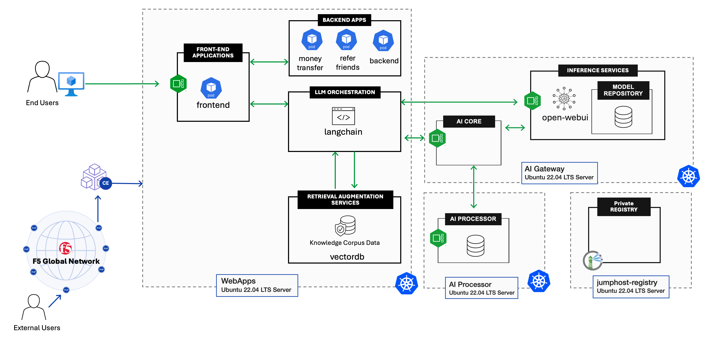

2 - Deploy Nginx Ingress Controller for AIGW K8S
------------------------------------------------

.. code-block:: bash

   cd ~/ai-gateway/nginx-ingress

.. code-block:: bash

   kubectl create ns nginx-ingress

.. code-block:: bash

   helm -n nginx-ingress install nginxic \
   oci://ghcr.io/nginxinc/charts/nginx-ingress -f values.yaml --version 1.4.0

.. code-block:: bash

   kubectl -n nginx-ingress get pod,svc

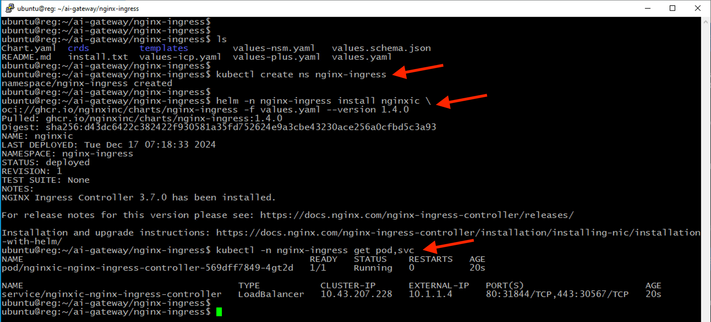

3 - Deploy Open-WebUI with Ollama Service
-----------------------------------------

**Open-Webui** is a self-hosted WebUI that allow user to interact with AI models. It allow user to download respective language model that use by Ollama.

**Ollama** is a open-source tools that allow user to run large language model. User can expose model access via Ollama inference API.

|

.. code-block:: bash

   cd ~/ai-gateway/open-webui-manifest

.. code-block:: bash

   kubectl create ns open-webui

.. code-block:: bash

   kubectl -n open-webui apply -k base

.. code-block:: bash

   kubectl -n open-webui get pod,svc

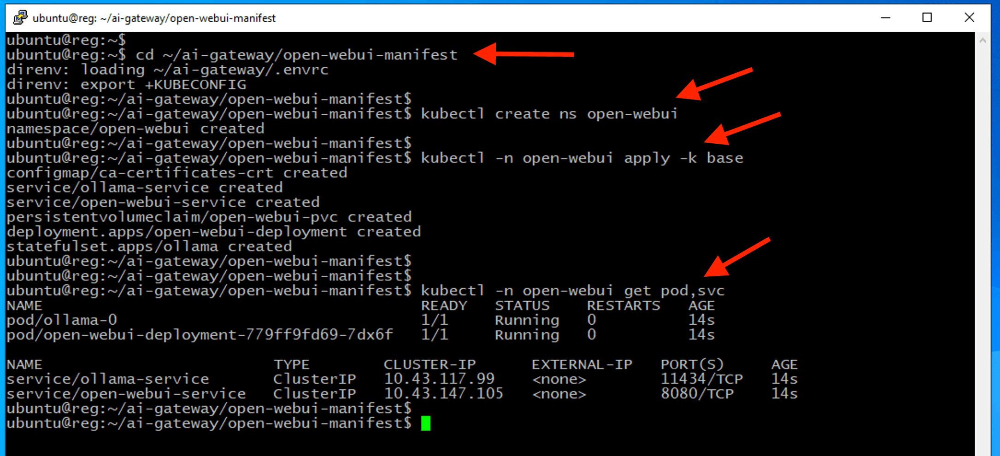

.. Note:: 
   Ensure all pods are in **Running** and **READY** state where all pods count ready before proceed.

Create an Nginx ingress resource to **expose the Open-WebUI service** externally from the Kubernetes cluster.

.. Note:: 
   We also create ingress for Ollama. We leverage mergable ingress resource for Nginx as we will need cross namespace access. 

.. code-block:: bash

   cd ~/ai-gateway/nginx-ingress-open-webui/

.. code-block:: bash

   ls -l

.. code-block:: bash

   kubectl -n open-webui apply -f open-webui-ingress-https.yaml

.. code-block:: bash

   kubectl -n open-webui apply -f ollama-ingress-http.yaml

.. code-block:: bash

   kubectl -n open-webui apply -f open-webui-ingress-ollama-minion.yaml

.. code-block:: bash

   kubectl -n open-webui get ingress

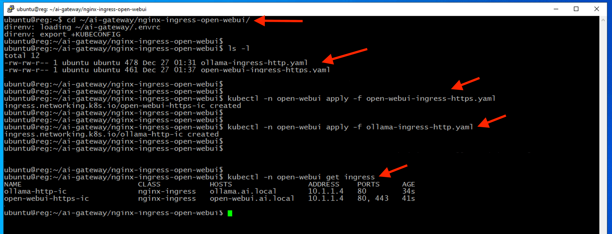

.. Note:: 
   Feel free to explore the content of those ingress resource to understand how those services being exposed.

From Chrome browser, confirm you can access to Open-Webui service.

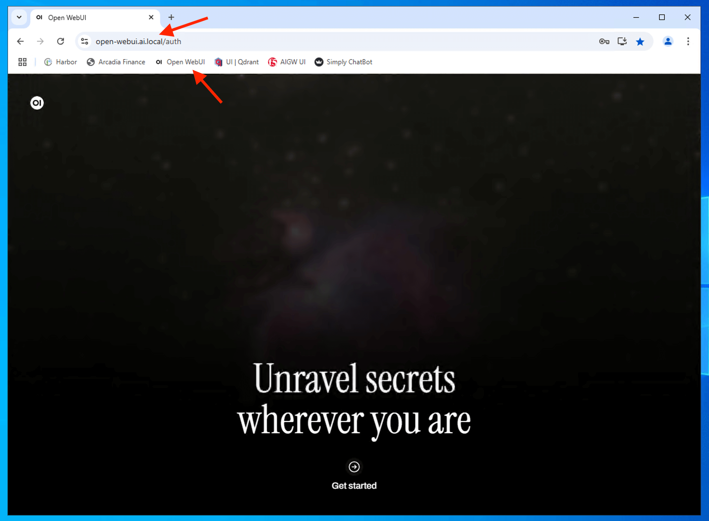

First time sign up a new user (any abitary name). Make sure you remember or use the suggested name

+----------------+---------------+
| **Name**       | F5 AI         |
+----------------+---------------+
| **Email**      | f5ai@f5.com   |
+----------------+---------------+
| **Password**   | F5Passw0rd    |
+----------------+---------------+

..  image:: ./_static/class3-7.png

Successfully signup and login to Open-WebUI

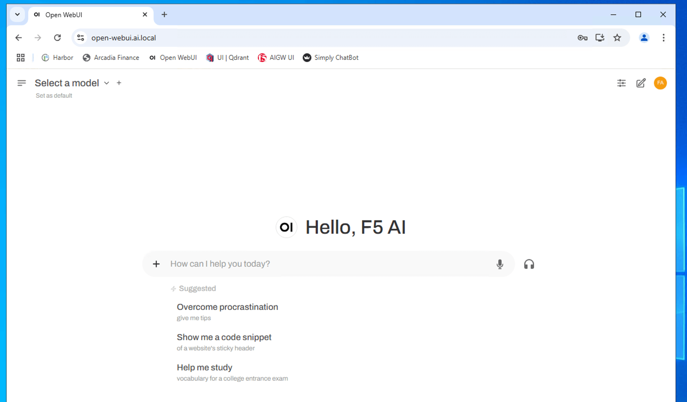

4 - Download Language Model
---------------------------

From Open WebUI, type the model name onto the search button and hover mouse to the click "Pull "xxxxxx" from Ollama.com" to pull the model down and host it locally.

..  image:: ./_static/class3-9.png

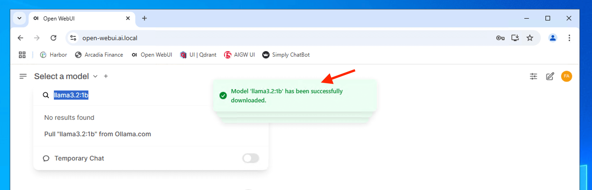

Repeat the above to download the following LLM model

+----------------------------+---------------------------------------------+
| **Model**                  | **Name**                                    |
+============================+=============================================+
| phi3                       | Microsoft (3.8b)                            |
+----------------------------+---------------------------------------------+
| phi3.5                     | Microsoft (3.8b)                            |
+----------------------------+---------------------------------------------+
| llama3.2:1b                | Meta Llama3.2 (1b)                          |
+----------------------------+---------------------------------------------+
| qwen2.5:1.5b               | Alibaba Cloud Qwen2 (1.5b)                  |
+----------------------------+---------------------------------------------+
| hangyang/rakutenai-7b-chat | Rakuten AI (7b)                             |
+----------------------------+---------------------------------------------+
| nomic-embed-text           | Open embedding model                        |
+----------------------------+---------------------------------------------+
| codellama:7b               | Meta generating and discuss code            |
+----------------------------+---------------------------------------------+

Ensure you have all the model downloaded before you proceed.

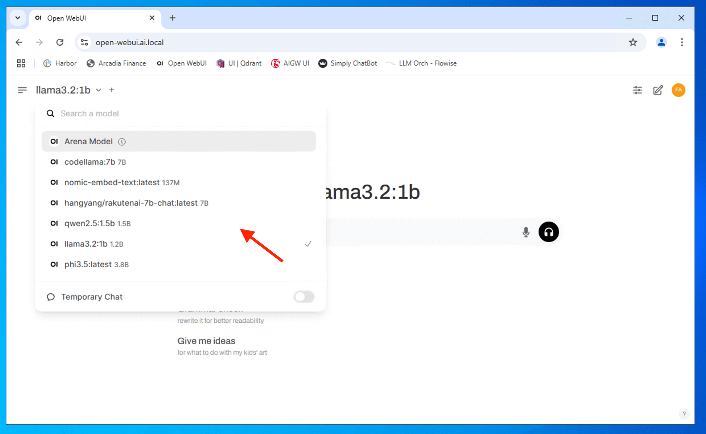

Test interacting with LLM model. Feel free to test with different language model.

.. attention:: 
   Please do note that UDF environment were setup with CPU (no GPU). Hence, all model inference will run on CPU instead of GPU. Performance may not be optimum but should be acceptable for lab. Please be patience as it depends on CPU consumption at that time of inference. First inference of the model may be slow and should be alright after that.

..  image:: ./_static/class3-12.png

.. attention:: 
   Please do notes that GenAI is hallucinating and providing wrong information - about F5 Inc headquarters. Please ignore as smaller model (smaller parameter, less intelligent) tend to hallucinate more compare to a larger model. Large models with more parameters are more capable and intelligent than smaller models, but require expensive machines with multiple GPUs to run. 
   
   Its also depends on dataset use for the training - "Garbage In, Garbage Out".

5 - Deploy LLM model service (Ollama)
-------------------------------------
Ollama API being exposed from previous step (step 3 above) when we ran *"kubectl -n open-webui apply -f ollama-ingress-http.yaml"* command.

.. Note:: 
   The Ollama API is currently exposed over HTTP instead of HTTPS. This is due to a limitation in the LLM orchestrator (FlowiseAI), which does not natively support self-signed certificates without some environment changes. To simplify the setup and eliminate resources consumption for encryption/decryption so that more CPU can be dedicated for inference, HTTP is used instead of HTTPS. However, all communication between the LLM orchestrator and other AI components occurs internally, within a controlled environment. For production deployment, ensure those communication are secure and encrypted. For FlowiseAI, you can define environment variable to ignore certificate verification. Please refer to official documentation.

Ollama API is the model serving endpoint. Since we are running inference from CPU, it will take a while for ollama to response to user. To ensure connections is not timeout on NGINX ingress, we need to increase the timeout on NGINX ingress for ollama. This nginx ingress resource for ollama had been deployed in step 3 above.

ollama-ingress-http.yaml ::
   
   apiVersion: networking.k8s.io/v1
   kind: Ingress
   metadata:
     name: ollama-http-ic
     annotations:
       nginx.org/proxy-connect-timeout: "120s"
       nginx.org/proxy-read-timeout: "120s"
       nginx.org/proxy-send-timeout: "120s"
   spec:
     ingressClassName: nginx-ingress
     rules:
     - host: ollama.ai.local
       http:
         paths:
         - path: /
           pathType: Prefix
           backend:
             service:
               name: open-webui-ollama
               port:
                  number: 11434

6 - Deploy LLM orchestrator service (Flowise AI)
------------------------------------------------
Deploy LLM Orchstrator to facilitate AI component communication. Flowise AI - an open source low-code tool for developer to build customized LLM orchstration flow and AI agent is used. (https://flowiseai.com/). Flowise complements LangChain by offering a visual interface.

.. code-block:: bash

   cd ~/webapps/

.. code-block:: bash

   ls

.. code-block:: bash

   cd ~/webapps/flowiseai

.. code-block:: bash

   helm repo add cowboysysop https://cowboysysop.github.io/charts/

.. code-block:: bash

   kubectl create ns flowiseai

.. code-block:: bash

   helm -n flowiseai install flowiseai --values values.yaml cowboysysop/flowise

.. code-block:: bash

   kubectl -n flowiseai get po,svc

..  image:: ./_static/class3-13.png

Flowise is installed with the following custom values. You can login with the password shown in the value file.

values.yaml ::

   image:
     registry: reg.ai.local
     repository: flowiseai/flowise
     tag: 2.2.3  

   serviceAccount:
     create: true   

   resources:
      limits:
        cpu: 4000m
        memory: 8Gi
      requests:
        cpu: 4000m
        memory: 8Gi   

   persistence:
     enabled: true
     size: 5Gi   

   config:
     username: "admin"
     password: "F5Passw0rd"   

   extraEnvVars:
    - name: LOG_LEVEL
      value: 'info'
    - name: DEBUG
      value: 'false'
    - name: NODE_TLS_REJECT_UNAUTHORIZED
      value: '0'

Create an Nginx ingress resource to **expose FlowiseAI/Langchain service** externally from the Kubernetes cluster.

.. code-block:: bash

   kubectl -n flowiseai apply -f flowise-ingress.yaml

.. code-block:: bash

   kubectl -n flowiseai get ingress

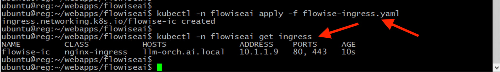

Confirm that you can login and access to LLM orchestrator (flowise)

.. attention:: 
   If no login prompt as shown below, likely credential was cache in the browser during the building phase of the lab. You can either do a clear browser cache or safely ignore if it doesn't ask for password.

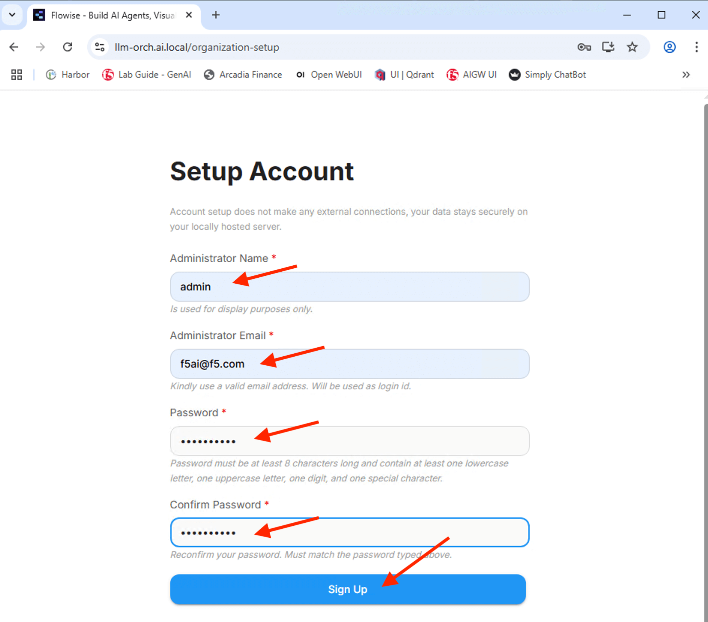

Import arcadia RAG chatflow into flowise. Select **Add New**, settings icons and **Load Chatflow**

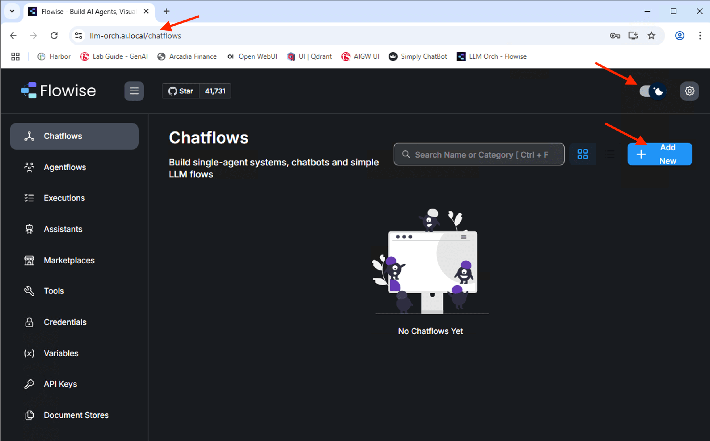

A copy of the chatflow located on the jumphost **Documents** directory. Select the chatflow json file.

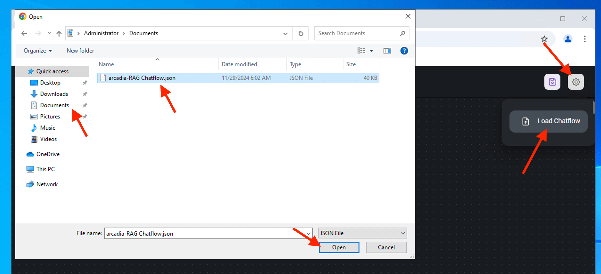

Save the chatflow with a name as shown.

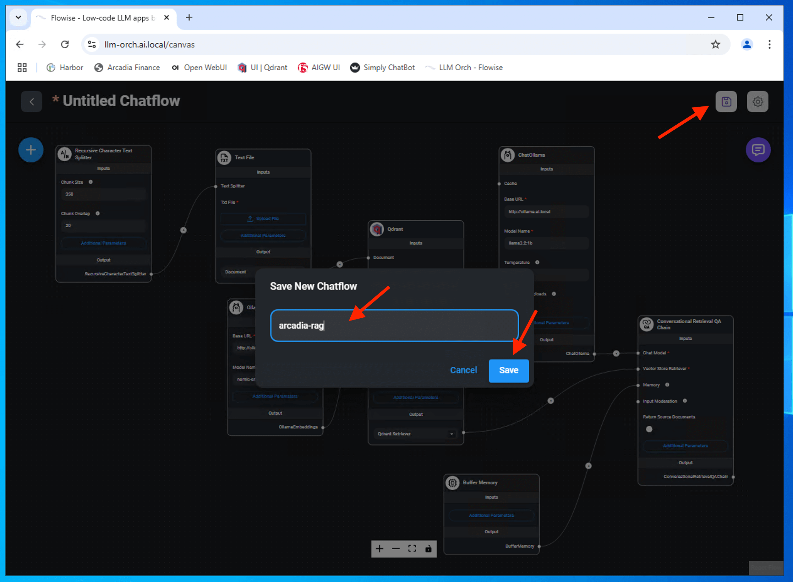

To successfully build the full langchain pipeline / chatflow, you need to upload organization context information into the RAG pipeline. Arcadia context information file located in the **Documents** directory. Under **Text File** node, Click **Upload File**

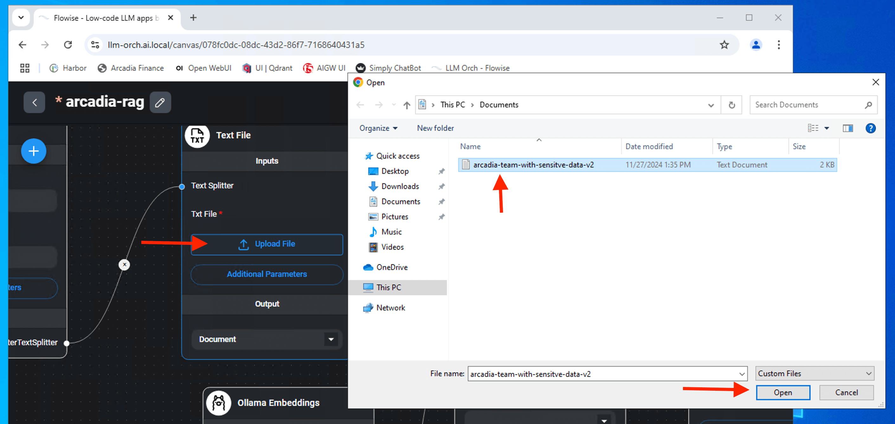

Save the chatflow with a name as shown.

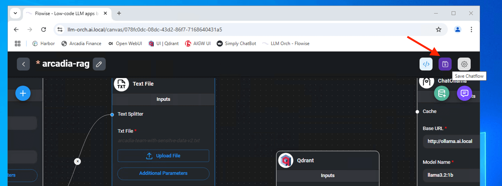

.. Note:: 
   We will return and continue to build RAG pipeline after we deploy vector database.  

7 - Deploy Vector Database (Qdrant)
-----------------------------------

**Qdrant** is a vector similarity search engine and vector database. It provides a production-ready service with a convenient API to store, search, and manage vectors points.

|

.. code-block:: bash

   cd ~/webapps/qdrant-helm

.. code-block:: bash

   helm repo add qdrant https://qdrant.github.io/qdrant-helm

.. code-block:: bash

   helm repo list

.. code-block:: bash

   kubectl create ns qdrant

.. code-block:: bash

   helm -n qdrant install qdrant --values values.yaml qdrant/qdrant

.. code-block:: bash

   kubectl -n qdrant get po,svc

..  image:: ./_static/class3-21.png

.. Note:: 
   Ensure all pods are in **Running** and **READY** state where all pods count ready before proceed.

Create an Nginx ingress resource to **expose Qdrant VectorDB service** externally from the Kubernetes cluster.

.. code-block:: bash

   cd ~/webapps/qdrant-helm/nginx-ingress-qdrant

.. code-block:: bash

   kubectl -n qdrant apply -f qdrant-ingress-http.yaml

.. code-block:: bash

   kubectl -n qdrant apply -f qdrant-ingress-https-ui.yaml

.. code-block:: bash

   kubectl -n qdrant get ingress

..  image:: ./_static/class3-22.png

Confirm that you can login to Qdrant vector database

.. attention:: 
   There is no authentication setup for qdrant console/dashboard. Hence, no login prompt. Its for lab and demo only. Ensure strong authentication is enforced in production environment.

..  image:: ./_static/class3-23.png

8 - Build RAG pipeline with FlowsieAI/Langchain
-----------------------------------------------

Load the imported "arcadia-rag" chatflow.

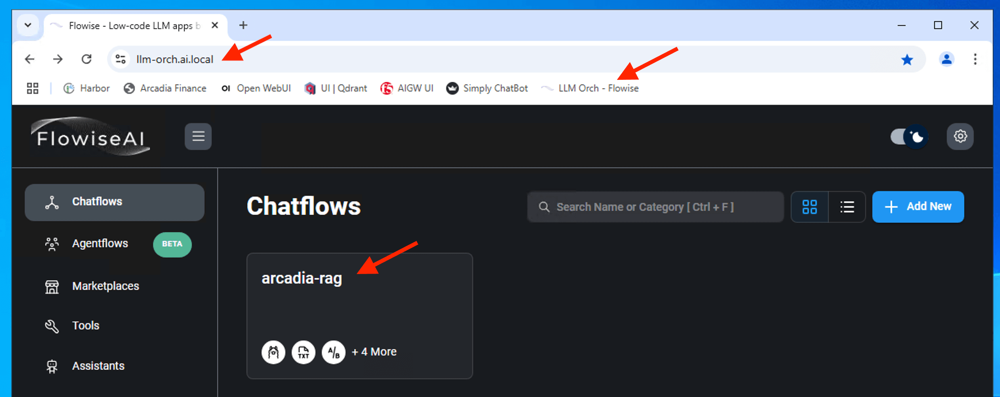

Here is the full RAG pipeline implmented in a low-code platform.

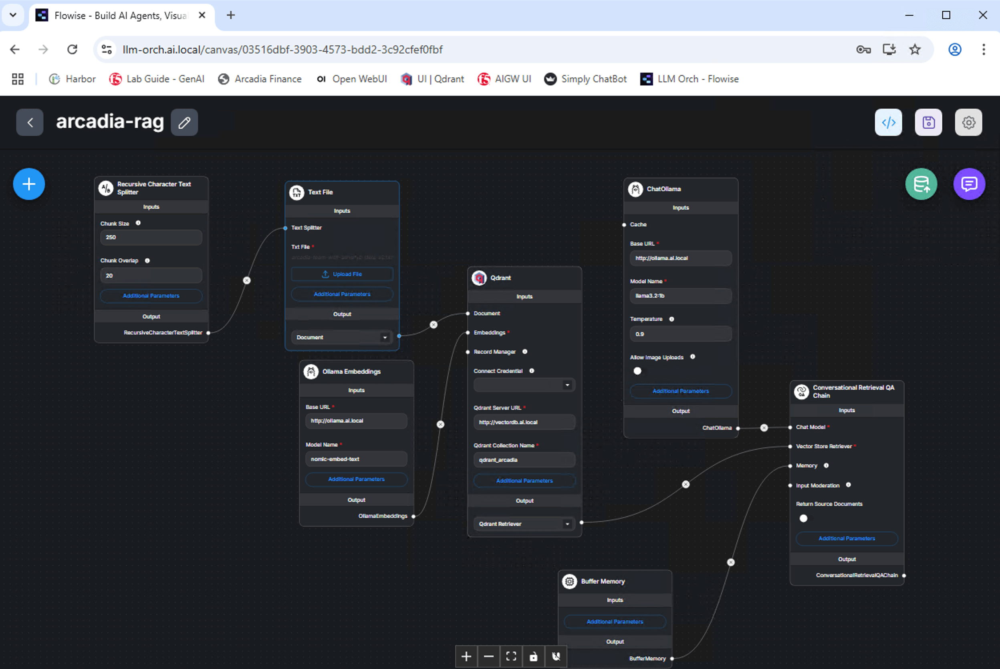

Here are some of the node/chain used.

+---------------------------------------------+-----------------------------------------------------------------------+
| Node / Chain                                | Description                                                           |
+=============================================+=======================================================================+
|  **Recursive Character Text Splitter**      |  Split documents recursively by different characters -                |
|                                             |  starting with "\n\n", then "\n", then " ".                           |
|     Chunck Size: 250                        |                                                                       |
|                                             |                                                                       |
|     Chunk Overlap : 20                      |                                                                       |
|                                             |                                                                       |
+---------------------------------------------+-----------------------------------------------------------------------+
|  **Text File**                              | Load data from text file                                              |
|                                             |                                                                       |
|  Txt File:                                  | This is the organization context information loaded                   |
|                                             | and vectoried into vector database                                    |
|     arcadia-team-with-sensitive-data-v2.txt |                                                                       |
|                                             |                                                                       |
+---------------------------------------------+-----------------------------------------------------------------------+
|  **Ollama Embeddings**                      | Generate embeddings for a given text using open source model on Ollama|
|                                             |                                                                       |
|  Base URL:                                  |                                                                       |
|                                             |                                                                       |
|     http://ollama.ai.local                  | This is where chunk of text being sent to vectorized                  |
|                                             | ollama.ai.local is an API endpoint where text will be send to         |
|  Model Name:                                | convert text into vector arrays.                                      |
|                                             |                                                                       |
|     nomic-embed-text                        |                                                                       |
+---------------------------------------------+-----------------------------------------------------------------------+
|  **Qdrant**                                 | Qdrant vector database node. Node to define vector db                 |
|                                             | locations, variable and collection name                               |
|  Qdrant Server URL:                         |                                                                       |
|                                             |                                                                       |
|     http://vectordb.ai.local                | This is the API endpoint where vector array being stored              |
|                                             | and retrieved                                                         |
|  Qdrant Collection Name:                    |                                                                       |
|                                             |                                                                       |
|     qdrant_arcadia                          |                                                                       |
+---------------------------------------------+-----------------------------------------------------------------------+
|  **ChatOllama**                             | A chat completion node for using LLM on Ollama.                       |
|                                             |                                                                       |
|  Base URL URL:                              |                                                                       |
|                                             |                                                                       |
|     http://ollama.ai.local                  | ollama.ai.local also the API inference endpoint                       |
|                                             |                                                                       |
|  Model Name:                                |                                                                       |
|                                             | llama3.2:1b will be use for the inference                             |
|     llama3.2:1b                             |                                                                       |
|                                             |                                                                       |
|  Temperature:                               |                                                                       |
|                                             |                                                                       |
|      0.9                                    |                                                                       |
+---------------------------------------------+-----------------------------------------------------------------------+
|  **Conversational Retrieval QA**            | A chain for performing question-answering tasks with                  |
|                                             | a retrieval component.                                                |
|  Chat Model                                 |                                                                       |
|                                             | Link all those node to the respective node                            |
|  Vector Store Retriever                     |                                                                       |
|                                             |                                                                       |
|  Memory                                     |                                                                       |
|                                             |                                                                       |
+---------------------------------------------+-----------------------------------------------------------------------+
|  **Buffer Memory**                          | Use Flowise database table chat_message as the                        |
|                                             | storage mechanism for storing/retrieving conversations.               |
+---------------------------------------------+-----------------------------------------------------------------------+

Vectorize Proprietary Data
~~~~~~~~~~~~~~~~~~~~~~~~~~

RAG incorporate proprietary data to complement models and deliver more contextually aware AI outputs. However, in NLP (Neural Language Processing), AI don't understand human language. Those texts or knowledge need to be converted into an understandable language by NLP where the process called embedding required to convert text into series of vector array.

**nomic-embed-text** is an embedding model that able to convert text into a vector array. In order for nomic-embed-text to work, the Qdrant dimension have to be updated to **768**.

From Windows Jumphost, update the Qdrant Chain dimension to 768.

Click on **Additional Parameter**

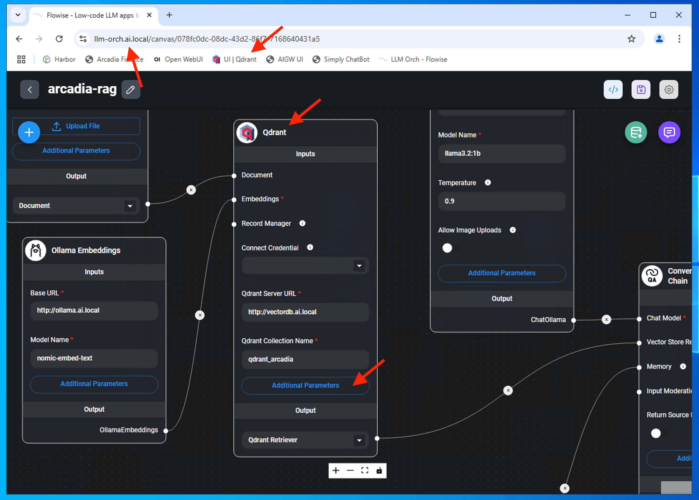

Ensure **Vector Dimension** is 768 and **Similarity** is **Cosine** 

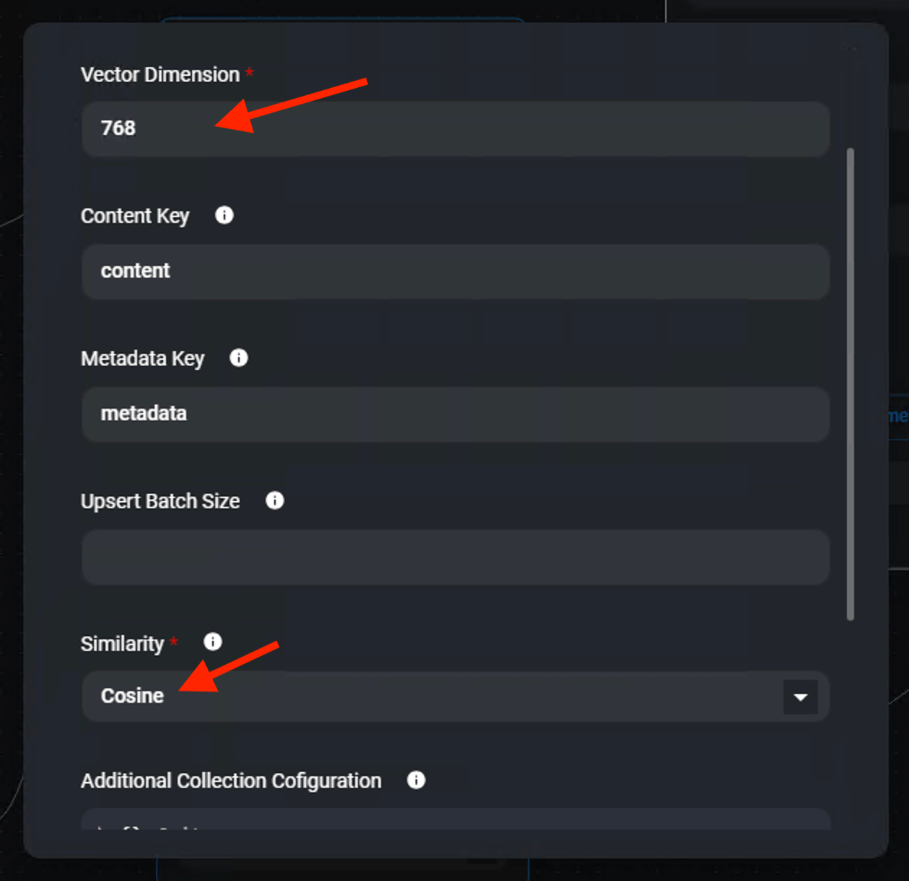

.. NOTE:: 
   Click anywhere outside to exit from the pop-up

Click **Upsert Vector Database**

..  image:: ./_static/class3-28.png

..  image:: ./_static/class3-29.png

Successfully upsert vector store. Ensure you save the chatflow.

..  image:: ./_static/class3-30.png

Login to Qdrant Dashboard to confirm vectordb created.

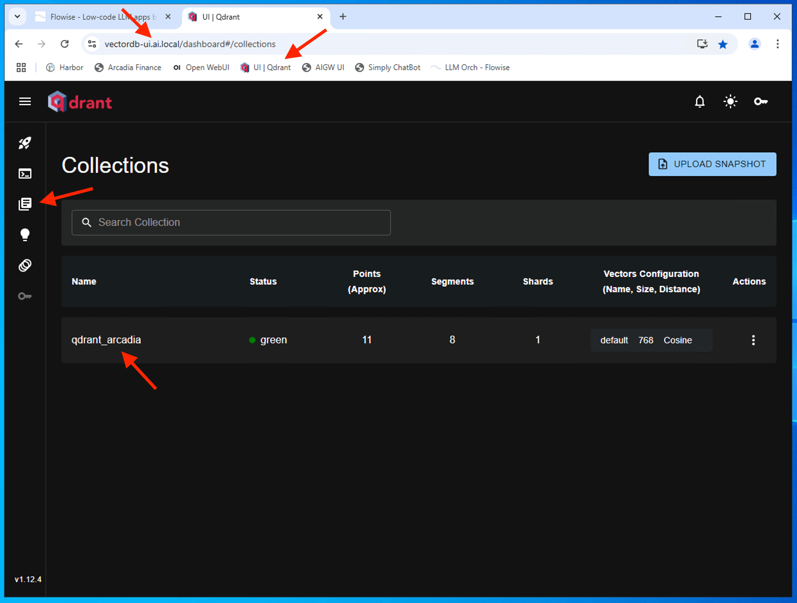

Validate your first GenAI RAG Chatbot
~~~~~~~~~~~~~~~~~~~~~~~~~~~~~~~~~~~~~

Click the Chat Icon

..  image:: ./_static/class3-32.png

Input on the chat box

.. code-block:: bash

   who is chairman of the board

.. attention:: 
   You are using CPU for inference. Hence, expect some delay in the response.

Sample RAG Chatbot conversation

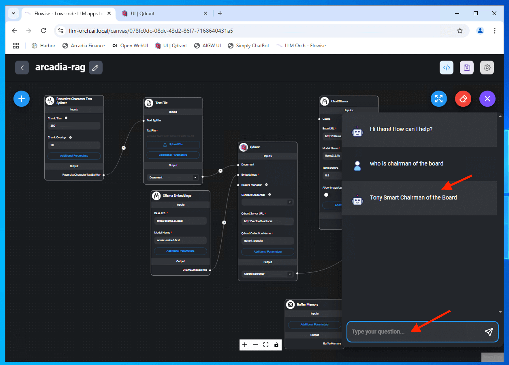

Suggested sample question ask to the RAG chatbot

.. code-block:: bash

   give me all the name from the board of director

.. code-block:: bash

   who is chris wong

.. code-block:: bash

   tell me more about david strong

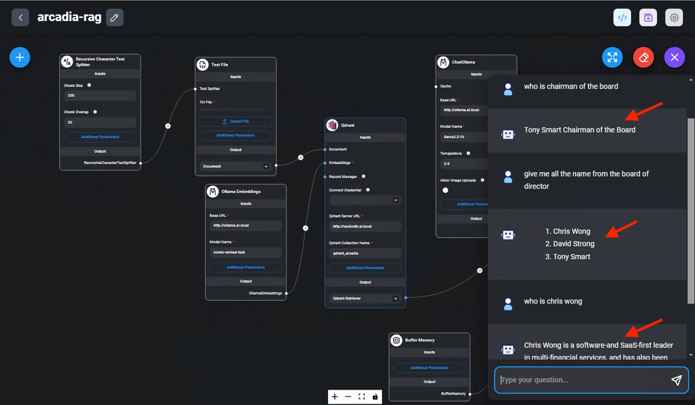

Source of inforamtion "proprietary data" obtained from the text file store on the Windows desktop under document folder.

..  image:: ./_static/class3-34.png

.. attention:: 
   Generic Small Language Model (SLM) may not be as efficient compare to a Large Language Model (LLM) and may constantly encounter hallucination. You may modify the chunking size and chuking overlap to reduce hallucination. For the purpose of a lab, we are not expecting the model to provides an accurate and intelligent answer.

**You have successfully build a GenAI RAG Chatbot**

|
|

.. toctree::
   :maxdepth: 1
   :glob:

