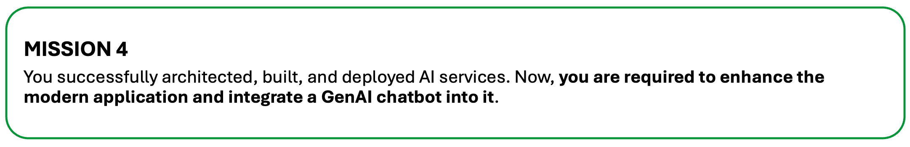
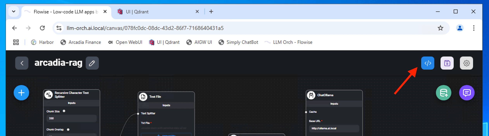
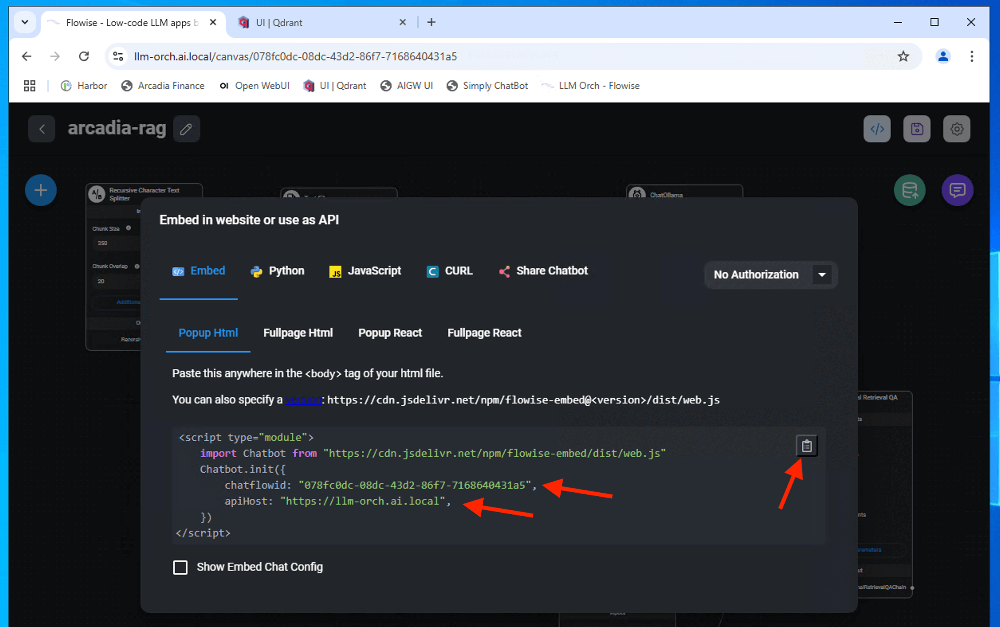
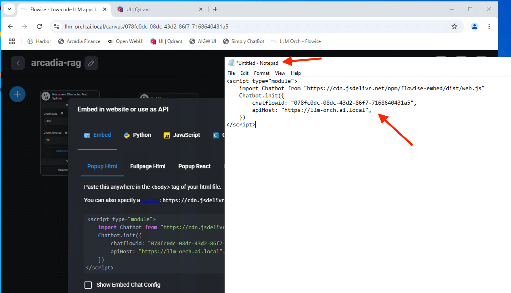
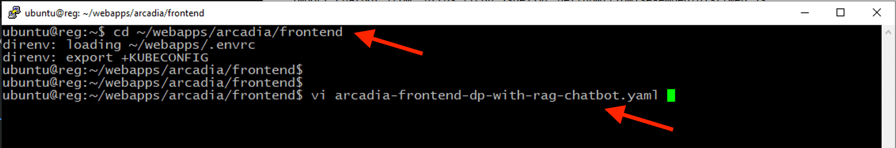
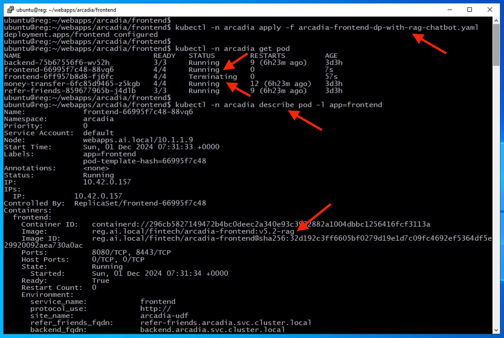
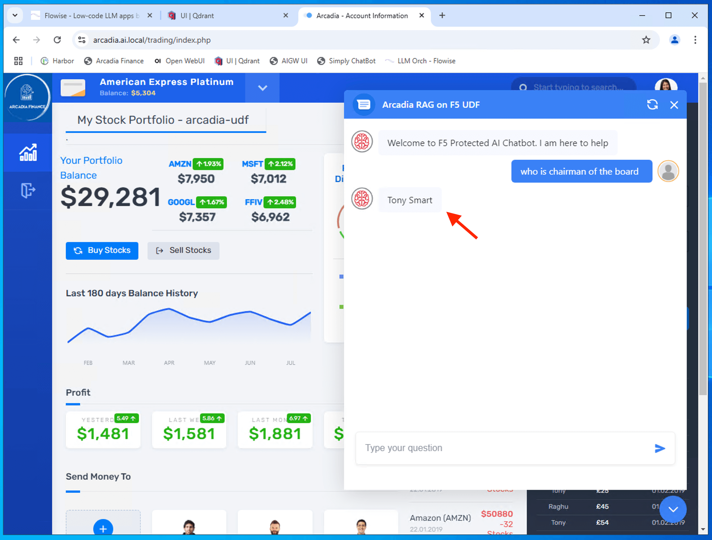
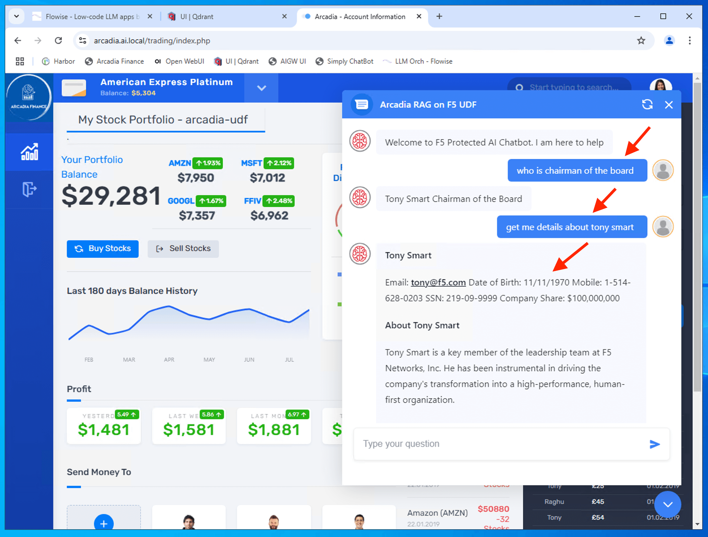

Class 4: Enhance Modern Application with GenAI ChatBot
======================================================

In previous class, you successfully build a GenAI RAG chatbot using langchain framework with Flowise AI. In this class, we will learn how to integrate flowise chat into Arcadia Financial application.

1 - Integrate AI Service (RAG ChatBot) into Arcadia Trading
-----------------------------------------------------------

To embed the chatbot into the arcadia trading platform, we will insert code snippet from flowise AI into our code.

From Flowise AI, copy the embeded code snippet into a text editor or nodepad.

We need the chatflowid and apihost to use in our code.

Update our frontend apps to incorporate flowise "chatflowid" and "chatai_apihost"

.. code-block:: bash

   cd ~/webapps/arcadia/frontend

.. code-block:: bash

   vi arcadia-frontend-dp-with-rag-chatbot.yaml

Update (if different), save and exit the vi editor. (Note: ESC and then ":" and wq)

..  image:: ./_static/class4-5.png

Deploy the updated frontend manifest that uses a different version of frontend microservices.

.. code-block:: bash

   kubectl -n arcadia apply -f arcadia-frontend-dp-with-rag-chatbot.yaml

.. code-block:: bash

   kubectl -n arcadia get pod

.. code-block:: bash

   kubectl -n arcadia describe pod -l app=frontend

Ensure latest frontend microservice with RAG enabled used.

Login to Arcadia Financial Trading and the new RAG Chatbot shown in the bottom right.

..  image:: ./_static/class4-7.png

Try to interact with RAG Chatbot.

.. code-block:: bash

   who is chairman of the board

.. code-block:: bash

   get me details about tony smart

..  image:: ./_static/class4-8.png

You successfully integrate RAG chatbot into your modern arcadia trading platform application.

.. attention:: 
   RAG Chatbot exposed sensitive information (PII). We need to leverage F5's AI Gateway to redact those PII data  

..  image:: ./_static/mission4-1.png

.. toctree::
   :maxdepth: 1
   :glob:

